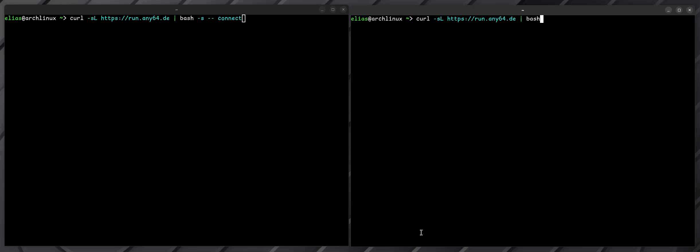

<div align="center">


</div>

<div align="center">

[](https://opensource.org/licenses/EUPL-1.2)
[](https://ko-fi.com/kernelpanic0x)


</div>

Get a **remote rescue shell** over [magic-wormhole](https://github.com/magic-wormhole/magic-wormhole) and [iroh](https://github.com/n0-computer/iroh) for an end-to-end encrypted interactive PTY session between multiple machines across NATs and firewalls.



## 🚀 Quick Start

### 🛟 1. On the machine needing help:
```sh
curl -sL https://run.any64.de | sh
```

or directly from github:
```sh
curl -sL https://raw.githubusercontent.com/kernelPanic0x/rescue-shell/main/install.sh | sh
```

It will display a one-time code (e.g., `7-guitar-battery`).

### ⛑️ 2. On the machine helping:
```sh
curl -sL https://run.any64.de | sh -s -- connect
```

or directly from github:
```sh
curl -sL https://raw.githubusercontent.com/kernelPanic0x/rescue-shell/main/install.sh | sh -s -- connect
```

Enter the code when prompted.

> [!NOTE]
> Press `Ctrl+]` to detach from the session cleanly.

Use `SHELL` environment variable to set a shell manually. It also sets `RESCUE_SHELL` environment variable to the path of the executable in case you need the OSC52 copy or wormhole functionality like this:

| Command | Description |
|---------|-------------|
| `$RESCUE_SHELL serve [OPTIONS]` | Host a session (Victim) |
| `$RESCUE_SHELL connect [OPTIONS]` | Connect to a session (Helper) |
| `$RESCUE_SHELL copy` | Copy stdin to OSC52 for remote clipboard |
| `$RESCUE_SHELL wormhole <COMMAND> [OPTIONS]` | full wormhole-rs cli version 0.8.1 included |

## 🧪 Tested platforms

| Platform | Status |
|----------|--------|
| Raspberry Pi 2B+ | ✅ |
| Google Pixel 7a (Termux) | ✅ |
| Arch Linux | ✅ |
| macOS | ⏳ not yet |
| Windows 11 | ✅ |
| FreeBSD 14+ | ⏳ not yet |

## 🏗️ Build from Source

```sh
git clone https://github.com/kernelPanic0x/rescue-shell
cd rescue-shell
cargo build --release
```
